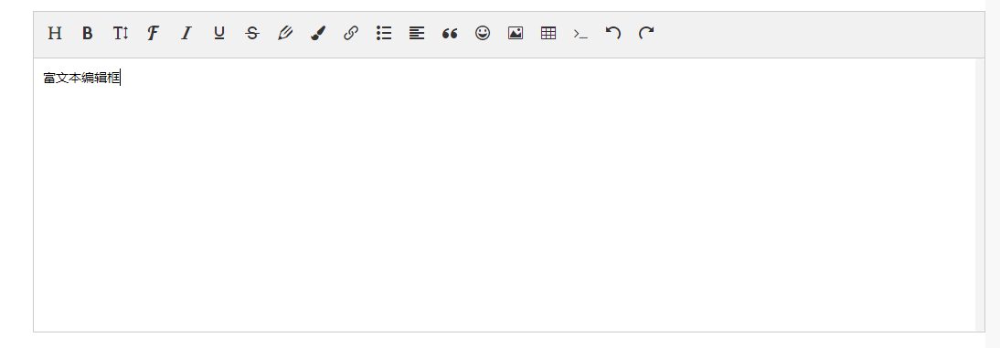

 # Vue Components


## PC端-项目中常用组件封装

---

* ### [DivInput.vue](https://github.com/CloudEmperor/blog/blob/master/components/vue/pc/DivInput.vue)
>
> div标签通过contenteditable属性，模仿input输入框，实现数据双向绑定。
>
> 组件使用：
>
> ```javascript
> <template>
>
>  <div-input v-model="value"></div-input>
>
> </template>
>
><script>
>    import DivInput from '@/components/DivInput'
>    export default {
>       components: { DivInput},
>        data() {
>            return {
>                value:''
>            }
>        }
>   }
></script>
>```


---

* ### [Editor.vue](https://github.com/CloudEmperor/blog/blob/master/components/vue/pc/Editor.vue)
>
> wangEditor —— 轻量级 web 富文本编辑器，配置方便，使用简单。支持 IE10+ 浏览器。<br>
> 为了方便项目中使用，特将wangEditor封装成组件。
>
> - 官网：[www.wangEditor.com](www.wangEditor.com)
> - 文档：[www.kancloud.cn/wangfupeng/wangeditor3/332599](www.kancloud.cn/wangfupeng/wangeditor3/332599)
> - 源码：[github.com/wangfupeng1988/wangEditor](github.com/wangfupeng1988/wangEditor)
>
>```javascript
>
> //npm安装
>
> npm install wangeditor
>
>```
>
> 组件使用：
>
> ```javascript
> <template>
>
>   <editor v-model="htmlText"  :input-content="introduction"> </editor>         
>
> </template>
>
><script>
>    import Editor from '@/components/Editor'
>    export default {
>       components: { Editor},
>        data() {
>            return {
>                htmlText:'',
>                introduction:'' //默认赋值
>            }
>        }
>   }
></script>
>```
>效果图点击查看：
>
> 
> 
>
>
>
>


---